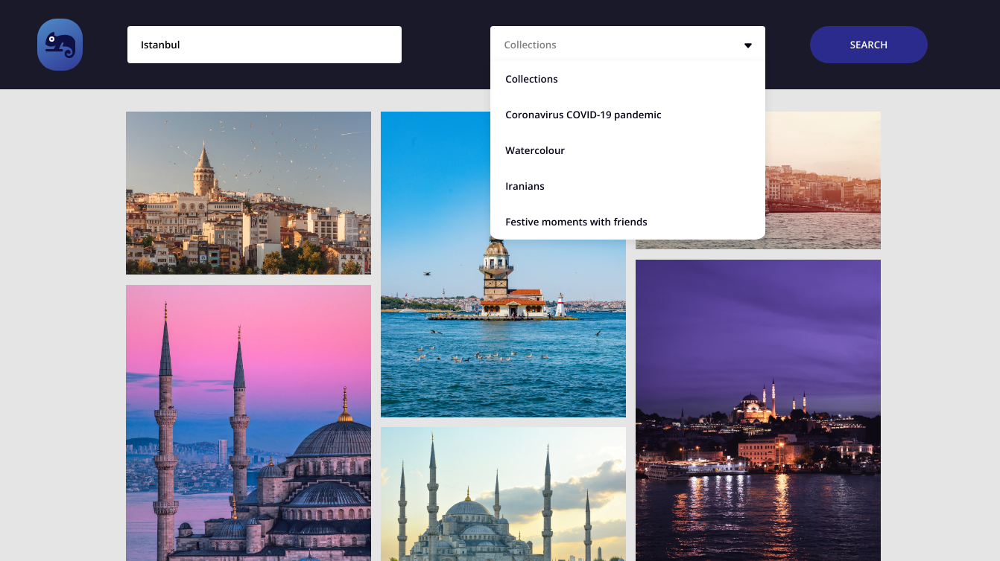

# unsplash-client-demo

In this web application, users will explore the photos published to Unsplash in a certain collection with a certain keyword. Collections are consist of unsplash's most featured 4 collections and placed dynamically.

No preparations needed. Simply open index.html to start.

Uses [Unsplash API](https://unsplash.com/developers) to work.

## Features

* [Axios](https://github.com/axios/axios) (Async http requests)
* [Sass](https://sass-lang.com/)
* Responsive Design
* Busy indicators
* No result handling
* HTTP request failure handling
* Infinite content with "load more" button

## Screenshot

---
This app uses Unsplash's only for learning purposes.

